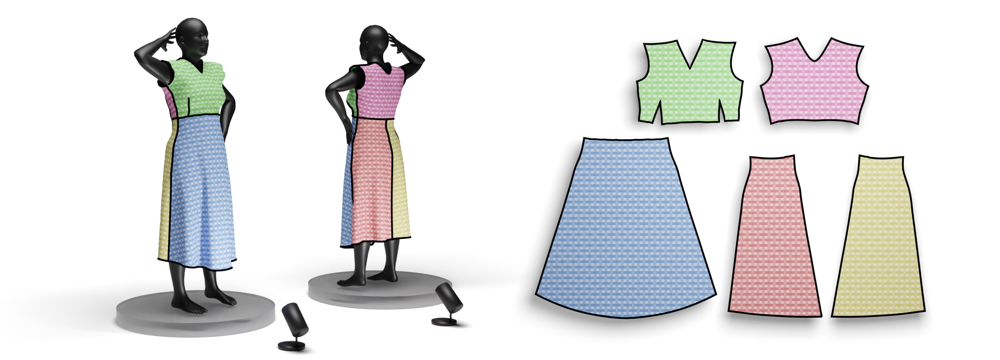

# Computational Pattern Making from 3D Garment Models

[Anonymous Author0](www.google.com), 
[Anonymous Author1](www.google.com),
[Anonymous Author2](www.google.com),
[Anonymous Author3](www.google.com),
[Anonymous Author4](www.google.com),
[Anonymous Author5](www.google.com),
<br/>
*SIGGRAPH 2022*<br/>



## Abstract
We propose a method for computing a sewing pattern of a given 3D garment model. Our algorithm segments an input 3D garment shape into patches and computes their 2D parameterization, resulting in pattern pieces that can be cut out of fabric and sewn together to manufacture the garment. Unlike the general state-of-the-art approaches for surface cutting and flattening, our method explicitly targets garment fabrication. It accounts for the unique properties and constraints of tailoring, such as seam symmetry, the usage of darts, fabric grain alignment, and a flattening distortion measure that models woven fabric deformation, respecting its anisotropic behavior. We bootstrap a recent patch layout approach developed for quadrilateral remeshing and adapt it to the purpose of computational pattern making, ensuring that the deformation of each pattern piece stays within prescribed bounds of cloth stress. While our algorithm can automatically produce the sewing patterns, it is fast enough to admit user input to creatively iterate on the pattern design. Our method can take several target poses of the 3D garment into account and integrate them into the sewing pattern design. We demonstrate results on both skintight and loose garments, showcasing the versatile application possibilities of our approach.

Data: [www.google.com](TBD)<br />
Website: [www.google.com](TBD)<br />
DOI: [TBD](https://doi.org/???) ACM Transactions on Graphics (SIGGRAPH), 2022

**BibTex**
```
@article{???,
author = {Anonymous},
title = {Computational Pattern Making from 3D Garment Models
},
year = {2022},
issue_date = {August 2022},
publisher = {Association for Computing Machinery},
address = {New York, NY, USA},
volume = {?},
number = {?},
issn = {?},
url = {https://doi.org/??},
doi = {??},
abstract = {We propose a method for computing a sewing pattern of a given 3D garment model. Our algorithm segments an input 3D garment shape into patches and computes their 2D parameterization, resulting in pattern pieces that can be cut out of fabric and sewn together to manufacture the garment. Unlike the general state-of-the-art approaches for surface cutting and flattening, our method explicitly targets garment fabrication. It accounts for the unique properties and constraints of tailoring, such as seam symmetry, the usage of darts, fabric grain alignment, and a flattening distortion measure that models woven fabric deformation, respecting its anisotropic behavior. We bootstrap a recent patch layout approach developed for quadrilateral remeshing and adapt it to the purpose of computational pattern making, ensuring that the deformation of each pattern piece stays within prescribed bounds of cloth stress. While our algorithm can automatically produce the sewing patterns, it is fast enough to admit user input to creatively iterate on the pattern design. Our method can take several target poses of the 3D garment into account and integrate them into the sewing pattern design. We demonstrate results on both skintight and loose garments, showcasing the versatile application possibilities of our approach.},
journal = {ACM Trans. Graph.},
month = {jul},
articleno = {155},
numpages = {17},
keywords = {geometry processing, modelling, fashion design}
}
```

### Download
```bash
git clone --recursive https://github.com/???/parafashion
git submodule update --init --recursive
```

## BUILD

The following packages are required: `qt5-default libqt5svg5-dev freeglut3-dev` (e.g. `sudo apt install ...` on Debian based systems).

```
mkdir build
cd build
cmake ..
make -j parafashion
```

Then, simply run parafashion with an obj or ply mesh as command-line argument: 
```
./parafashion <Mesh>
```


## (Alternatively) using QT Creator

Open the .pro file, all the path in the .pri should be already ok.

## The output of parafashion consists of several files:
- The output patch subdivided mesh (suffix patch.obj): Per face, per patch colored mesh.
- The output patch index per face (suffix patch.txt)
- The output per face per vert UV (suffix UV.txt)
- For each patch the UV and 3D (suffix patch_UV_#.obj and  patch_3D_#.obj)
- patch decomposition ready to be fabricated (suffix patch.svg)

---

## Note
The code has slightly changed and the results could be different from the ones showed in the paper.

## License
[GPL3](LICENSE) licensed
([FAQ](https://www.gnu.org/licenses/gpl-faq.html))


